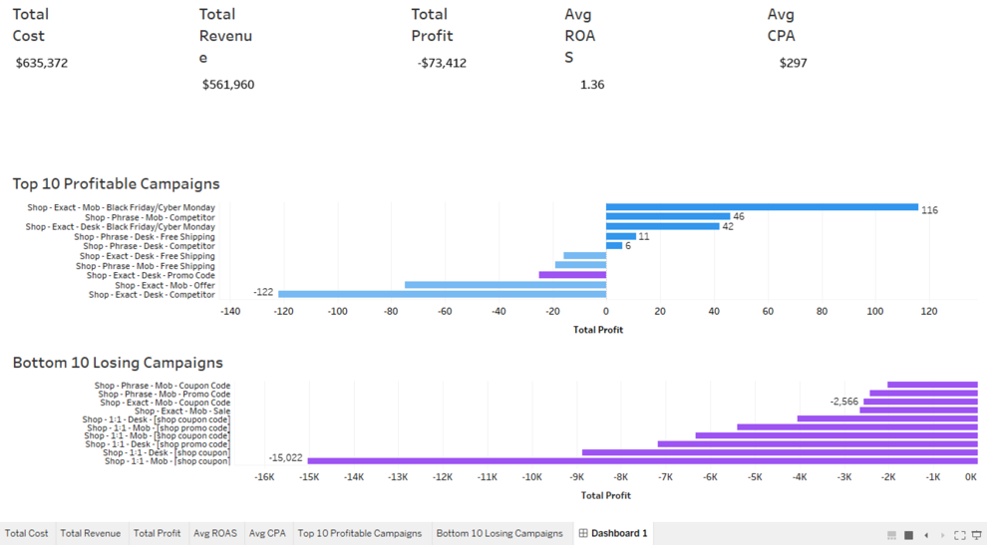

# paid-search-marketing-analytics
End-to-end paid search marketing analytics project using Python and Tableau. Includes KPI validation, campaign profitability analysis, and dashboard.
# Paid Search Marketing Analytics Project

## 📌 Project Overview
This project analyzes 5 months of paid search campaign data to evaluate performance, profitability, and budget efficiency. The goal was to identify which campaigns should be scaled, optimized, or paused.

## 🎯 Business Objective
- Validate core marketing KPIs (CTR, Conversion Rate, CPC, CPA, ROAS, Profit)
- Identify high-spend loss drivers
- Recommend budget reallocation strategies
- Build an executive-level Tableau dashboard

## 🛠 Tools Used
- Python (Pandas)
- Google Colab
- Tableau
- GitHub

## 📊 Key KPIs Calculated
- CTR (Click Through Rate)
- Conversion Rate
- CPC (Cost Per Click)
- CPA (Cost Per Acquisition)
- ROAS (Return on Ad Spend)
- Campaign Profit

## 🔍 Key Insights
- Overall campaign portfolio operated at a loss over 5 months.
- A small number of high-spend campaigns drove the majority of losses.
- Several low-spend campaigns demonstrated strong ROAS and scaling potential.
- Budget reallocation could significantly improve profitability.

## 📈 Dashboard
Live Tableau Dashboard: [Add Tableau Public Link Here]

## 💡 Recommendations
- Audit and optimize high-spend loss-making campaigns.
- Gradually scale profitable low-spend campaigns.
- Implement ROAS and CPA thresholds for budget allocation.
- Monitor performance before increasing spend.

*This project demonstrates marketing analytics, KPI validation, business storytelling, and dashboard development skills.*
